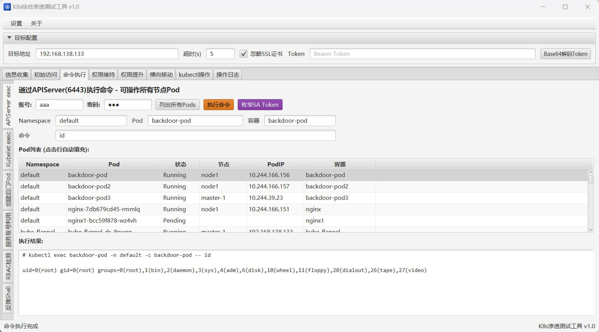
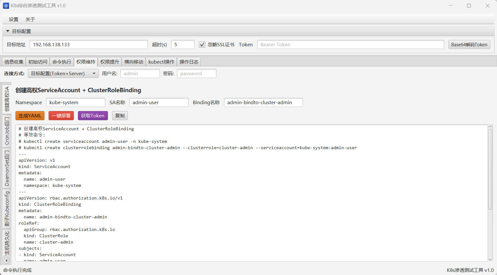
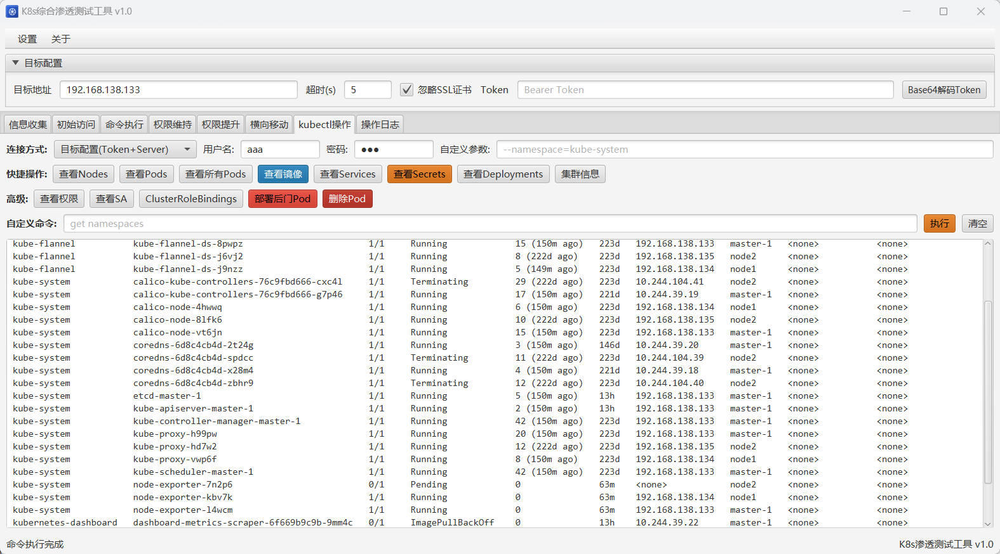

# K8sPenTool

> Kubernetes 综合渗透测试工具 — 一站式 K8s 安全评估 GUI 平台

**作者: T3Y**



---

## 简介

K8sPenTool 是一款基于 **JavaFX** 的 Kubernetes 渗透测试工具，将常见 K8s 攻击链集成到统一图形界面中，覆盖从**信息搜集**到**横向移动**的完整渗透流程，帮助安全研究人员快速评估 Kubernetes 集群的安全态势。

## 功能模块

| 模块 | 说明 |
|------|------|
| 🔍 **信息搜集** | 容器环境辨别、特权检测、Capabilities 解码、K8s 端口扫描、SA Token 枚举 |
| 🚪 **初始访问** | APIServer 未授权检测、Kubelet API 利用、Etcd 未授权、Dashboard 检测、Kubeconfig 解析 |
| ⚡ **命令执行** | APIServer/Kubelet exec、后门 Pod 部署、反弹 Shell 生成、RBAC 权限检查 |
| 🔒 **权限维持** | Admin SA 创建、CronJob/DaemonSet 持久化、影子 Kubeconfig、宿主机持久化 |
| 🔓 **权限提升** | 特权容器逃逸、挂载逃逸（procfs/docker.sock/disk）、内核漏洞利用 |
| 🌐 **横向移动** | Secret 凭证窃取、集群内网探测、污点容忍横向扩展 |
| 🛠 **kubectl 操作** | 快捷 kubectl 命令、自定义命令执行、后门 Pod 管理 |

## 技术栈

- **Java 17+** / **JavaFX 17**
- **Maven** 构建
- **Gson** JSON 解析
- **maven-shade-plugin** 打包 Fat JAR

## 快速开始

### 环境要求

- JDK 17 或更高版本
- Maven 3.6+

### 编译

```bash
git clone https://github.com/trymonoly/K8sPenTool.git
cd K8sPenTool
mvn clean package
```

### 运行

```bash
java -jar target/k8s-pen-tool-1.0.0.jar
```

> 如果系统 `java` 不在 PATH 中，请使用完整路径，例如:
> ```bash
> /path/to/jdk-17/bin/java -jar target/k8s-pen-tool-1.0.0.jar
> ```

## 项目结构

```
K8sPenTool/
├── pom.xml                          # Maven 配置
├── src/main/java/
│   ├── module-info.java
│   └── com/k8spen/tool/
│       ├── Main.java                # JavaFX Application 入口
│       ├── Launcher.java            # 启动器 (shade 兼容)
│       ├── controller/
│       │   ├── MainController.java  # FXML 聚合控制器 (薄委托层)
│       │   ├── ControllerContext.java# 共享上下文与工具方法
│       │   ├── InfoHandler.java     # 信息搜集
│       │   ├── AccessHandler.java   # 初始访问
│       │   ├── ExecHandler.java     # 命令执行
│       │   ├── PersistHandler.java  # 权限维持
│       │   ├── EscapeHandler.java   # 权限提升
│       │   ├── LateralHandler.java  # 横向移动
│       │   └── KubectlHandler.java  # kubectl 操作
│       └── helper/
│           ├── K8sHttpUtil.java     # HTTP 请求工具
│           ├── PodTableItem.java    # Pod 表格数据模型
│           └── SecretTableItem.java # Secret 表格数据模型
├── src/main/resources/
│   └── gui.fxml                     # 界面布局
└── img/                             # 截图目录
```

## 截图

| 截图 | 说明 |
|------|------|
|  | 命令执行 — APIServer exec Pod |
|  | 权限维持 — 创建高权 SA |
|  | kubectl 操作面板 |

---

## ⚠️ 风险警告

本工具包含的功能可能对目标系统造成**不可逆的影响**，包括但不限于:

- 🔴 **数据泄露** — 读取 Secret、Token、Kubeconfig 等敏感信息
- 🔴 **服务中断** — 部署/删除 Pod、DaemonSet 等可能影响业务
- 🔴 **权限提升** — 创建 cluster-admin 服务账号、植入后门
- 🔴 **容器逃逸** — 利用特权容器或内核漏洞逃逸到宿主机
- 🔴 **横向移动** — 利用窃取的凭证扩大攻击面

## 📜 免责声明

1. **本工具仅用于合法授权的安全测试与研究用途。**
2. 使用者应确保已获得目标系统所有者的**明确书面授权**，并在授权范围内进行测试。
3. **严禁**将本工具用于任何未经授权的渗透测试、攻击或其他非法活动。
4. 作者 **T3Y** 不对任何滥用、误用或非法使用本工具所造成的直接或间接损失承担任何责任。
5. 使用本工具即表示您已阅读并同意以上声明，所有后果由使用者自行承担。

## License

MIT License — 详见 [LICENSE](LICENSE)

---

<p align="center">
  <b>K8sPenTool</b> — Made with ☕ by <b>T3Y</b>
</p>
